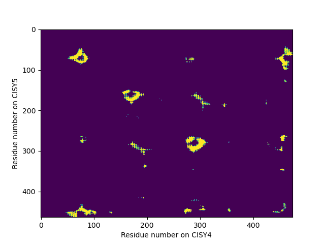
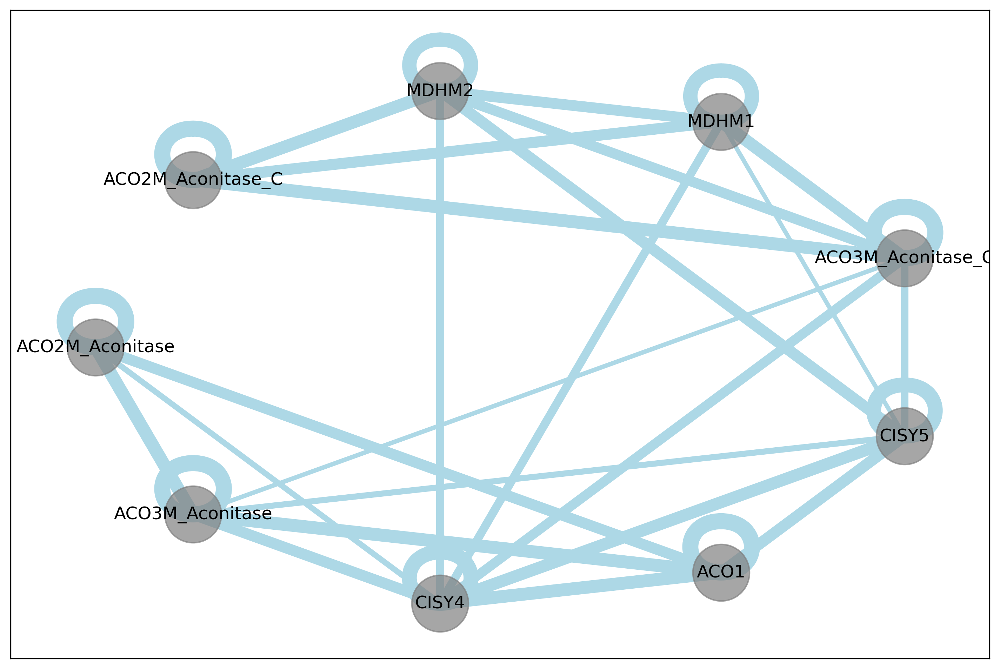

# distance-map
Calculating distance maps between subunits of PDB or mCIF files

Example

```
$ pixi run python distance-map.py 1XI4.pdb 1XT4
```

For more example calls, see `./examples.sh`.

Example with filtering and renaming

```
$  pixi run python distance-map.py fold_2024_06_13_10_02_athal_metabolon_model_0.cif af3/ --names "A:PGAM1-a,B:PGAM1-2,C:enolase_2-1,D:enolase_2-2,E:PYK4-1,F:PYK4-2" --filter AB:DC
```

This script will write the an analysis of the requested subunit interactions to the output folder. It makes 2 types of analyses:

A contact map for each interaction.




A subunit interaction graph.


